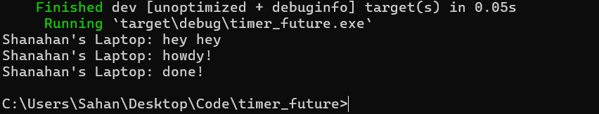
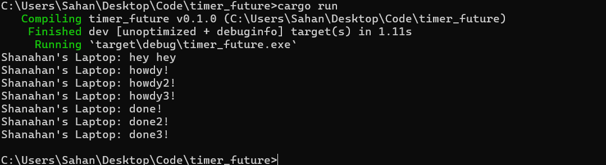
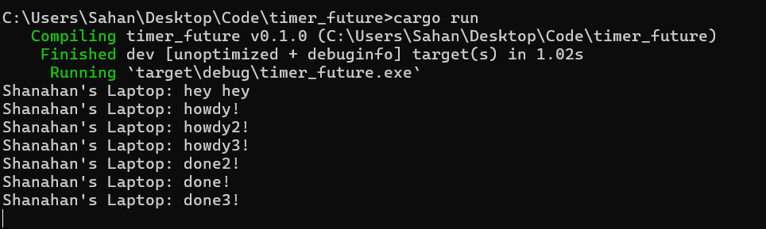

Experiment 1.2: Understanding how it works:

Dapat terlihat dari foto di atas teks yang muncul duluan adalah Shanahan's Laptop: hey hey. Hal ini dikarenakan teks ini berada di atas drop(spawner) dan executor.run(). Hal ini menyebabkan pesan ini muncul duluan sebelum pesan lainnya yang ada dalam Spawner. Setelah itu, pesan yang muncul adalah Shanahan's Laptop: howdy! dilanjutkan dengan Shanahan's Laptop: done! setelah 2 detik. Hal ini dikarenakan pesan ini berada di dalam spawner dan diexecute saat executor.run() dijalankan.

Experiment 1.3: Multiple Spawn and removing drop
- With drop(spawner)

- Without drop(spawner)

Lampiran di atas menunjukkan perbedaan antara penggunaan drop(spawner) dan tanpa drop(spawner). Dapat dilihat bahwa ketika drop(spawner) digunakan, maka pesan yang muncul sesuai yang ditulis pada kode saya beserta delay yang diatur. Kemudian program akan secara otomatis menutup setelah semua pesan selesai dijalankan. Sedangkan ketika drop(spawner) tidak digunakan, maka pesan yang muncul sesuai dengan yang kita tulis di kode, namun program tidak akan menutup secara otomatis. Hal ini dikarenakan drop(spawner) digunakan untuk membantu eksekutor tahu kapan program harus berhenti. Jika drop(spawner) tidak digunakan, maka program tidak akan tahu kapan harus berhenti dan akan terus berjalan. Selain itu, pesan dengan kata done bisa saja muncul dengan tidak berurutan. Hal ini disebabkan oleh delay 2 detik yang ada sehingga eksekutor bisa saja menjalankan task dalam urutan yang tidak terduga karena sistem yang asinkron

